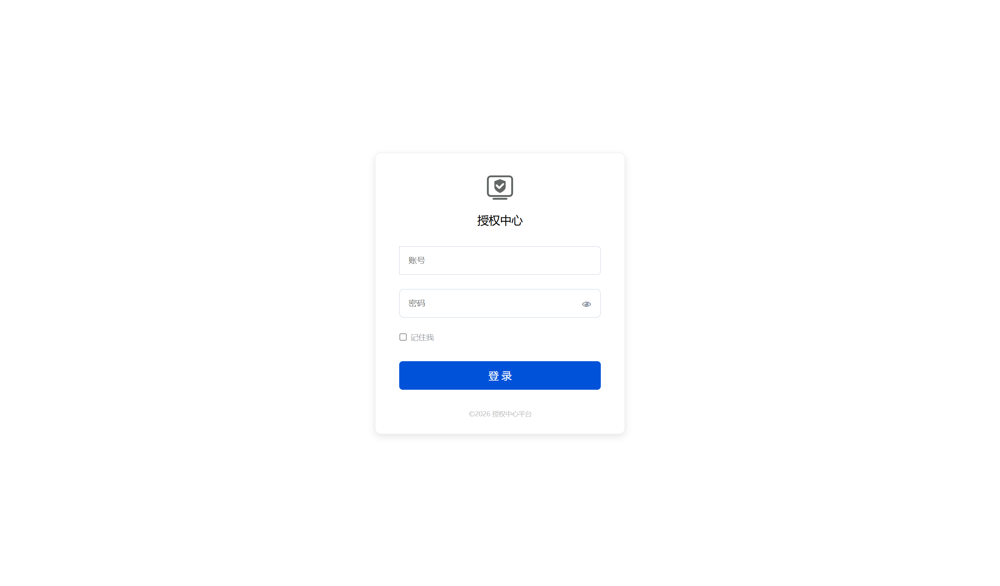
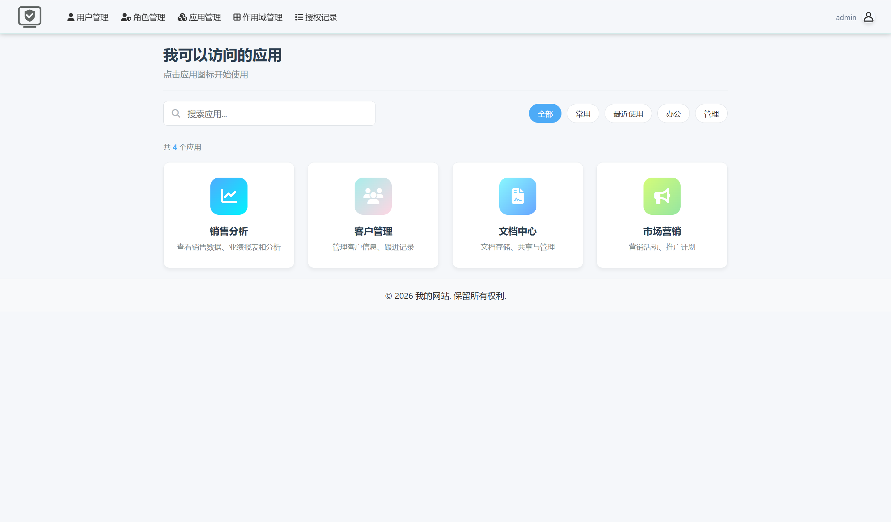
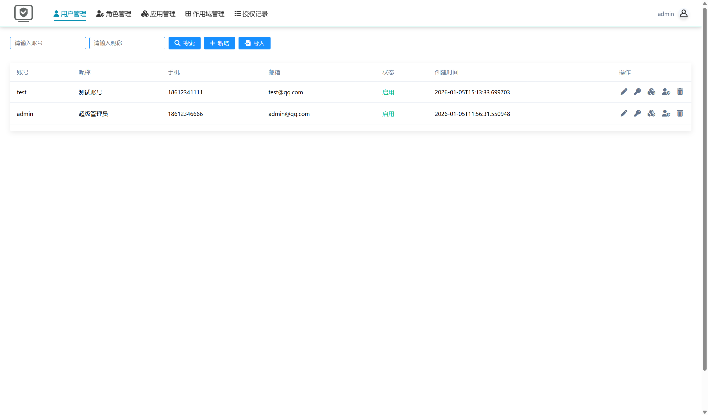
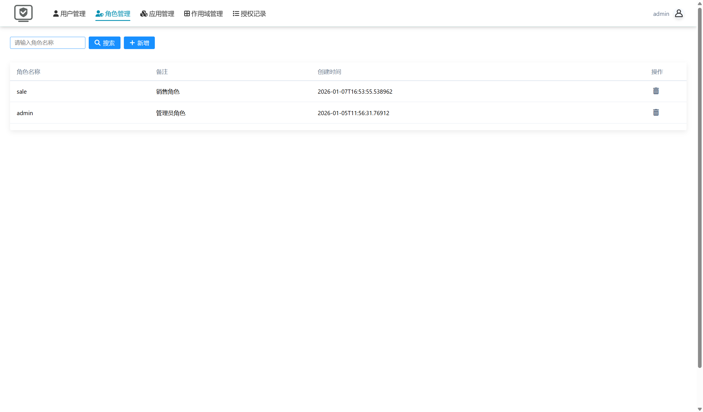
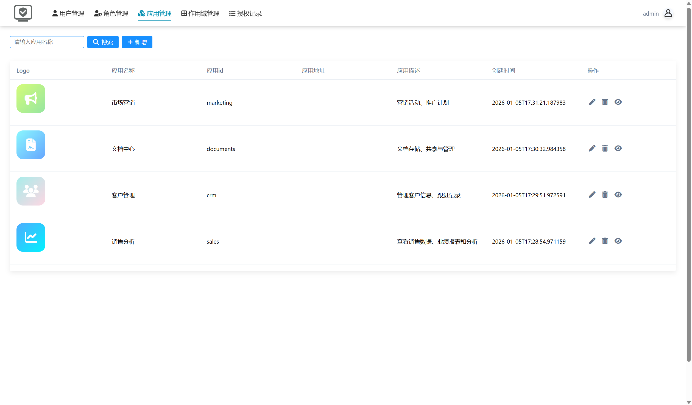
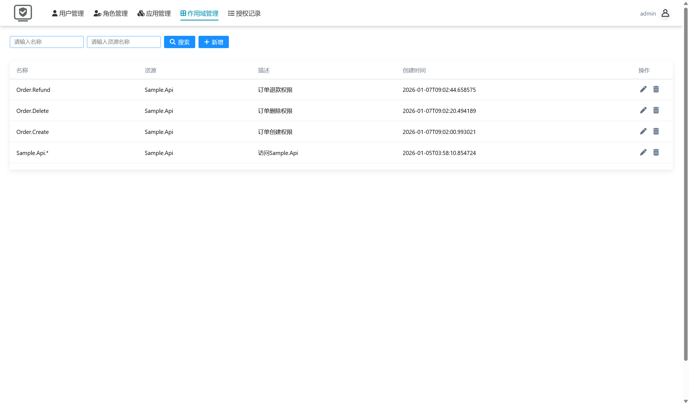
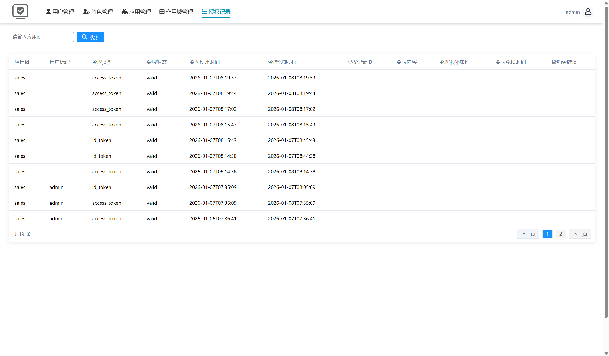
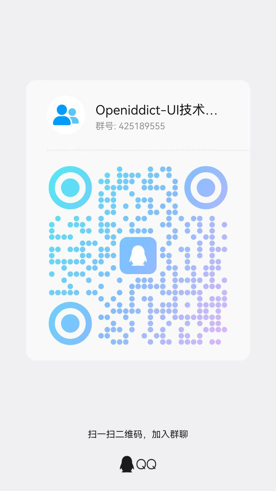

# 项目介绍
OpenIddict是一个基于.NET平台的开源OpenID Connect和OAuth 2.0框架，专门用于构建安全、标准化的身份验证和授权系统。它的核心优势在于其轻量级、模块化的设计，以及与ASP.NET Core生态系统的深度集成，使.NET开发者能够快速搭建自己的授权服务器，
而OpenIddict-UI是为了服务于OpenIddict授权框架，提供了完整的授权可视化配置管理页面。

# 功能列表
OpenIddict完整支持 OpenID Connect (OIDC) 和 OAuth 2.0 的核心协议与功能，提供了多种授权模式以适应不同的应用场景。
OpenIddict支持的主要功能类别：
| 功能类别         | 支持的具体功能与说明                                                                                                                                                              |
| :--------------- | :------------------------------------------------------------------------------------------------------------------------------------------------------------------------------- |
| **核心协议**     | **OpenID Connect** (用户身份认证)   **OAuth 2.0** (API资源授权)                                                                                                                 |
| **授权模式**     | **授权码模式** (Authorization Code Flow)   **客户端凭证模式** (Client Credentials Flow)   **密码模式** (Password Flow)   **刷新令牌模式** (Refresh Token Flow)   **设备授权模式** (Device Authorization Flow) |
| **令牌类型**     | **访问令牌** (Access Token)   **身份令牌** (ID Token)   **刷新令牌** (Refresh Token)                                                                                         |
| **高级安全特性** | **Proof Key for Code Exchange (PKCE)** (增强授权码流程安全)   **Pushed Authorization Requests (PAR)** (防止请求篡改)                                                              |
| **第三方集成**   | 内置支持 **100+ 外部提供商**的登录集成 (如：Google, GitHub, Microsoft, 微信，阿里云等)                                                                                              |

OpenIddict-UI支持的功能列表：
1. 用户管理
2. 角色管理
3. 应用管理
4. 作用域管理
5. 授权记录

# 功能截图

# 一键部署
~~~
# 1. 下载项目
git clone https://github.com/blackstarstar007/Openiddict-UI.git

# 2. 复制环境变量示例文件
cp .env.example .env

# 3. 启动所有服务
sudo docker-compose up -d

# 4. 访问管理后台（默认账号admin/123456）
http://localhost:5000
~~~

# Openiddict-UI交流群
QQ群：